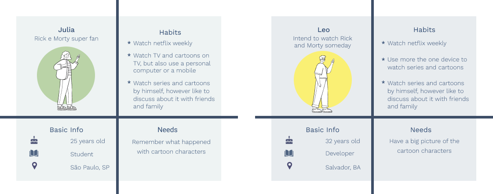

# Rick and Morty Dashboard

An app for fans and curious to venture through a dashboard about Ricky and Morty

## Index

* [About](#about)
* [User Experience](#user-experience)
* [User Interface](#user-interface)
* [Build With](#build-with)
* [Acknowledgments and Credits](#acknowledgments-and-credits)
* [Authors](#authors)

## About
Rick and Morty is a cartoon about the ventures through crazy time-space travels and parallel universes starring Rick Sanchez,  a brilliant scientist, and his (not so smart) grandson, Morty Smith. (Netflix)

*“The universe is a crazy and chaotic place, Morty!”*

The show has 4 seasons, 41 episodes and 671 characters until now. Besides the countless characters, they live in different places, are from multiple universes, from several species and some of them are dead (this is not a spoiler). So, that is a lot of data to assimilate and the time distance between the seasons makes it harder to remember. 

*“Wubba lubba dub dub!”* 

That said, this Dashboard was made to help fans to get information about people and not humans of Rick and Morty’s multiverse. 

## User Experience

To developed this app some UX methods was incorporated at the process:
- Created protopersonas;
- Validated protpersonas with questionnaire application;
- Created User Stories.

***
**Personas**

**User stories**

User story 1
"As a user, I want to see all characters in one page"

Acceptance criteria
- User can see all the cartoon cards on the main page
- User can flip the card to get more information about the character
- User can access the developer's repositories
- User can access the app by mobile with a responsive design

Definition of done
- Code was formatted according to the style guide
- Code was reviewed
- Code was refactored
- The code is on the repository

User story 2
"As a user, I want to order the cartoon cards so I can see them in alphabetic order"

Acceptance criteria
- User can see all the cartoon cards on the main page
- User can choose if he/she wants to order the characters in alphabetic order or the other way around

Definition of done
- Code was formatted according to the style guide
- Code was reviewed
- Code was refactored
- Code has and passes in needed tests
- The code is on the repository
- User story was tested with, at least, 5 users, and the needed improvements identified in the usability test was incorporated

User story 3
"As a user, I want to filter the characters by a specific aspect (gender or status or species) so I can see all the characters that share this same aspect"

Acceptance criteria
- User can choose if he/she wants to order the characters in alphabetic order or the other way around
- User can see the characters list according to the filter criteria applied
- User gets statistical information about how many characters share this same aspect on the cartoon universe

Definition of done
- Code was formatted according to the style guide
- Code was reviewed
- Code was refactored
- Code has and passes in needed tests
- The code is on the repository
- User story was tested with, at least, 5 users, and the needed improvements identified in the usability test was incorporated

User story 4
"As a user, I want a search input so I can search a character by its location"

Acceptance criteria
- User can choose if he/she wants to order the characters in alphabetic order or the other way around
- User can see the character card filtered by the name typed on the search input.

Definition of done
- Code was formatted according to the style guide
- Code was reviewed
- Code was refactored
- Code has and passes in needed tests
- The code is on the repository
- User story was tested with, at least, 5 users, and the needed improvements identified in the usability test was incorporated

## User Interface
*"Sometimes science is more art than science."*

The dashboard aesthetic was based on the cartoon's color palette, mostly on the clothes of the two main characters, and we use cards to organize the data based on the quiz results. Besides that, we incorporate user's suggestions in our interface, as use quotes and remarkable symbols of the story. 

The interface was conceived to be responsive since our users use more than one device to watch the series and probably will use our app to discuss with friends and family about the cartoon. We did not make a screen for tablets, because our users do not use this device, so we choose to prioritize the most used devices. 

***
**Desktop Low Fidelity Prototype**

***
**Mobile Low Fidelity Prototype**

## Build With 
* HTML5
* CSS3
* Vanilla JavaScript

## Acknowledgments and Credits
* [Laboratoria](https://www.laboratoria.la/)
* [Rick and Morty API](https://rickandmortyapi.com/)

## Authors
* Beatriz Penalva | [@beatrizpenalva](https://github.com/beatrizpenalva) 
